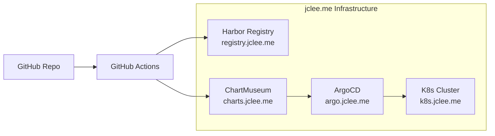

# GitOps Kubernetes Deployment

**FortiGate Nextrade** - CNCF-compliant GitOps deployment with Kustomize & ArgoCD

## 🚀 GitOps Architecture



## 📁 Directory Structure

```
k8s/
├── manifests/              # Core Kubernetes manifests
│   ├── 01-namespace.yaml   # Namespace definition
│   ├── 02-serviceaccount.yaml # Service account and RBAC
│   ├── 03-configmap.yaml   # Application configuration
│   ├── 04-secrets.yaml     # Secrets (API keys, registry)
│   ├── 05-deployment.yaml  # Main deployment
│   ├── 06-service.yaml     # Service definition
│   ├── 07-ingress.yaml     # Ingress configuration
│   ├── 08-servicemonitor.yaml # Prometheus monitoring
│   ├── 09-alerting-rules.yaml # Alert rules
│   ├── 10-redis.yaml       # Redis cache deployment
│   └── kustomization.yaml  # Kustomize configuration
├── argocd/                 # ArgoCD GitOps configurations
│   ├── fortinet-application.yaml # ArgoCD application
│   └── image-updater-config.yaml # Image auto-update config
└── apply.sh               # Manual deployment script
│   ├── service.yaml         # Service definition
│   └── kustomization.yaml   # Base kustomization
├── overlays/               # Environment-specific overlays
│   ├── development/        # Dev environment
│   │   ├── kustomization.yaml
│   │   ├── configmap-patch.yaml
│   │   └── resources-patch.yaml
│   ├── staging/           # Staging environment
│   │   ├── kustomization.yaml
│   │   ├── ingress.yaml
│   │   └── hpa.yaml
│   └── production/        # Production environment
│       ├── kustomization.yaml
│       ├── ingress-tls.yaml
│       ├── hpa.yaml
│       ├── pdb.yaml
│       └── monitoring.yaml
├── external-dns/          # External DNS configuration
└── templates/             # Helm chart templates
```

## Overview - GitOps Features

The GitOps deployment includes:
- **Namespace**: `fortinet` - Isolated namespace for all resources
- **Kustomize Base + Overlays**: Environment-specific configuration
- **ArgoCD Integration**: Automated GitOps sync
- **HPA**: Auto-scaling from 2-10 pods based on CPU/Memory usage
- **Ingress**: HTTPS access via `fortinet.jclee.me` with TLS
- **PVC**: Persistent storage for data and logs
- **Monitoring**: Prometheus metrics integration

## Prerequisites

1. Kubernetes cluster (1.19+)
2. kubectl configured
3. NGINX Ingress Controller
4. cert-manager (for TLS certificates)
5. Storage class that supports ReadWriteMany (for multi-pod access)

## Quick Deployment

### 1. Create image pull secret (if using private registry)
```bash
kubectl create secret docker-registry regcred \
  --docker-server=registry.jclee.me \
  --docker-username=<username> \
  --docker-password=<password> \
  --docker-email=<email> \
  -n fortinet
```

### 2. Update secrets
Edit `k8s/secret.yaml` with your actual credentials:
- FortiGate/FortiManager/FortiAnalyzer hosts and API keys
- Application secret key

### 3. Deploy with Kustomize
```bash
# Deploy all resources
kubectl apply -k k8s/

# Or with custom image tag
kustomize build k8s/ | kubectl apply -f -
```

### 4. Verify deployment
```bash
# Check pods
kubectl get pods -n fortinet

# Check services
kubectl get svc -n fortinet

# Check ingress
kubectl get ingress -n fortinet

# View logs
kubectl logs -n fortinet -l app=fortinet -f
```

## Configuration

### Environment Variables
All configuration is managed through:
- `configmap.yaml` - Non-sensitive configuration
- `secret.yaml` - Sensitive credentials

### Storage
- **Data PVC**: 20Gi for application data
- **Logs PVC**: 10Gi for application logs

Adjust sizes in `pvc.yaml` based on your needs.

### Auto-scaling
HPA is configured to scale based on:
- CPU utilization: 70%
- Memory utilization: 80%
- Min replicas: 2
- Max replicas: 10

### Resource Limits
Default resource limits per pod:
- Requests: 256Mi memory, 200m CPU
- Limits: 1Gi memory, 1000m CPU

## Monitoring

### Health Checks
- Liveness probe: `/api/health` (120s initial delay)
- Readiness probe: `/api/health` (30s initial delay)

### Logs
```bash
# Application logs
kubectl logs -n fortinet deployment/fortinet -f

# Redis logs
kubectl logs -n fortinet deployment/fortinet-redis -f
```

## Troubleshooting

### Pod not starting
```bash
# Check pod events
kubectl describe pod -n fortinet <pod-name>

# Check logs
kubectl logs -n fortinet <pod-name> -c setup-permissions
kubectl logs -n fortinet <pod-name> -c fortinet
```

### Permission issues
The init container sets proper permissions for data/logs directories.

### Storage issues
Ensure your storage class supports ReadWriteMany if running multiple replicas.

## Updates

### Update image
```bash
# Update deployment with new image
kubectl set image deployment/fortinet fortinet=registry.jclee.me/fortinet:v1.2.3 -n fortinet

# Or use Kustomize
kustomize edit set image registry.jclee.me/fortinet:v1.2.3
kubectl apply -k k8s/
```

### Rolling updates
Deployments use RollingUpdate strategy by default.

## Backup

### Data backup
```bash
# Create backup pod
kubectl run backup --rm -it --image=busybox -n fortinet \
  --overrides='{"spec":{"containers":[{"name":"backup","image":"busybox","command":["sh"],"volumeMounts":[{"name":"data","mountPath":"/data"}]}],"volumes":[{"name":"data","persistentVolumeClaim":{"claimName":"fortinet-data-pvc"}}]}}'

# Inside the pod, tar the data
tar -czf /tmp/backup-$(date +%Y%m%d).tar.gz /data/
```

## Clean up

```bash
# Delete all resources
kubectl delete -k k8s/

# Delete namespace (removes everything)
kubectl delete namespace fortinet
```