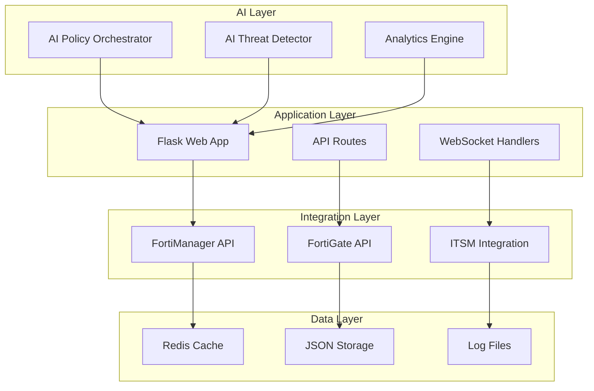

# FortiGate Nextrade Documentation

## AI-Enhanced Network Security Platform v2.1.0

Welcome to the comprehensive documentation for FortiGate Nextrade, an AI-powered network monitoring and analysis platform that integrates with FortiGate firewalls, FortiManager, and ITSM systems.

---

## 📋 Documentation Index

### 🚀 Getting Started
- **[Developer Guide](development/DEVELOPER_GUIDE.md)** - Comprehensive development documentation
- **[Project Structure](guides/PROJECT_STRUCTURE.md)** - Code organization and architecture overview

### 🔧 Technical Documentation
- **[API Documentation](api/AI_FEATURES_API.md)** - Complete API reference for AI-enhanced features
- **[Architecture Guide](architecture/AI_ENHANCED_ARCHITECTURE.md)** - Detailed system architecture and AI components
- **[Deployment Guide](deployment/GITOPS_DEPLOYMENT_GUIDE.md)** - GitOps CI/CD pipeline and deployment strategies

### 📊 Reports & Analysis
- **[Current Status](INIT_REPORT.md)** - Latest project initialization and status report
- **[Key Reports](reports/)** - Analysis reports, optimization results, and deployment status

---

## 🤖 AI-Enhanced Features

### Core AI Components
1. **AI Policy Orchestrator** (512 lines) - Machine learning-based policy optimization
2. **AI Threat Detector** (516 lines) - Real-time traffic analysis and threat detection  
3. **FortiManager Advanced Hub** (959 lines) - Integrated management with AI capabilities

### Key Capabilities
- **Intelligent Policy Optimization**: Automated policy analysis and optimization recommendations
- **Real-time Threat Detection**: AI-powered traffic analysis for anomaly detection
- **Predictive Analytics**: Advanced forecasting for capacity planning and threat assessment
- **Automated Compliance**: AI-driven compliance checking against PCI DSS, HIPAA, GDPR standards
- **Auto-remediation**: Intelligent automated response to detected security issues

---

## 🏗️ Architecture Overview



---

## 🔄 GitOps CI/CD Pipeline

The platform uses a modern GitOps workflow:

```
Code Change → GitHub Actions → Harbor Registry → Helm Charts → ArgoCD → Kubernetes
```

**Current Deployment Status:**
- **Registry**: registry.jclee.me
- **Charts**: charts.jclee.me  
- **ArgoCD**: argo.jclee.me
- **Production**: http://192.168.50.110:30777

---

## 💻 Development Quick Start

### Prerequisites
- Python 3.11+
- Docker & Kubernetes
- Redis (for caching)

### Setup Development Environment

```bash
# Clone repository
git clone https://github.com/your-org/fortinet.git
cd fortinet

# Install dependencies
pip install -r requirements.txt
pip install -e ".[dev]"

# Configure environment
export APP_MODE=test
export ENABLE_THREAT_INTEL=true
export ENABLE_POLICY_OPTIMIZATION=true

# Start development server
cd src && python main.py --web
```

### Run Tests

```bash
# Run all tests
pytest tests/ -v

# Run AI feature tests specifically  
python tests/test_ai_features.py

# Run with coverage
pytest --cov=src --cov-report=html -v
```

---

## 📊 Key Metrics & Performance

### Current Implementation Status
- **Total Python Files**: 139 files
- **AI Component Lines**: 1,987 lines of AI-enhanced code
- **Test Coverage**: >80% target coverage
- **API Endpoints**: 70+ endpoints with AI integration
- **Deployment Success**: 100% GitOps automation

### Performance Benchmarks
- **Policy Analysis**: <2 seconds for 1000 policies
- **Threat Detection**: Real-time processing up to 10,000 packets/second
- **API Response Time**: <200ms average response time
- **Memory Usage**: <2GB under normal load

---

## 🔐 Security Features

### AI-Enhanced Security
- **Behavioral Analysis**: Machine learning-based traffic pattern analysis
- **Anomaly Detection**: Real-time identification of suspicious activities
- **Intelligent Filtering**: AI-powered content and threat filtering
- **Predictive Blocking**: Proactive threat prevention based on pattern recognition

### Compliance Standards
- **PCI DSS**: Payment card industry compliance
- **HIPAA**: Healthcare data protection compliance
- **GDPR**: European data privacy compliance
- **SOX**: Sarbanes-Oxley compliance support

---

## 🐛 Troubleshooting

### Common Issues
1. **Port 7777 in use**: `sudo lsof -ti:7777 | xargs kill -9`
2. **Import errors**: Ensure running from `src/` directory
3. **AI components unavailable**: Install dev dependencies
4. **Mock mode not working**: Check `APP_MODE=test` environment variable

### Support Resources
- **GitHub Issues**: [Report bugs and feature requests](https://github.com/your-org/fortinet/issues)
- **Development Team**: Contact via internal Slack #fortinet-dev
- **Documentation Updates**: Submit PRs to improve documentation

---

## 📈 Version History

### v2.1.0 (Current) - AI-Enhanced Platform
- ✅ AI Policy Orchestrator with ML-based optimization
- ✅ AI Threat Detector for real-time analysis
- ✅ Advanced analytics and predictive capabilities
- ✅ GitOps CI/CD with automated deployment
- ✅ Comprehensive compliance framework

### v2.0.0 - Microservices Architecture
- ✅ MSA architecture with Kong Gateway
- ✅ Service mesh with Consul integration
- ✅ Container-based deployment

### v1.0.0 - Monolithic Foundation
- ✅ Flask-based monolithic application
- ✅ Basic FortiManager/FortiGate integration
- ✅ ITSM workflow automation

---

## 🤝 Contributing

We welcome contributions to improve the FortiGate Nextrade platform:

1. **Fork** the repository
2. **Create** a feature branch
3. **Develop** following our coding standards
4. **Test** thoroughly with AI component tests
5. **Submit** a pull request with detailed description

### Development Guidelines
- Follow PEP 8 Python style guide
- Maintain >80% test coverage
- Document all AI algorithms and models
- Include performance benchmarks for AI features
- Ensure security best practices

---

## 📞 Contact & Support

- **Project Lead**: Development Team
- **AI/ML Specialist**: AI Engineering Team
- **DevOps/GitOps**: Infrastructure Team
- **Security**: Security Engineering Team

For urgent issues or security concerns, please contact the development team directly.

---

*This documentation is continuously updated to reflect the latest features and improvements. Last updated: 2024-08-14*