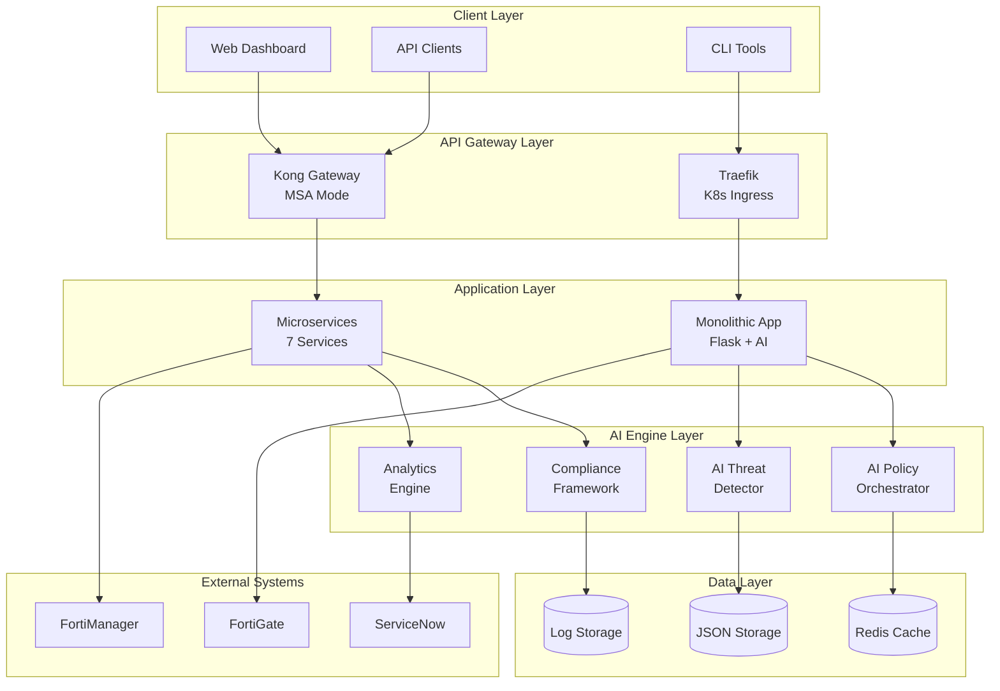
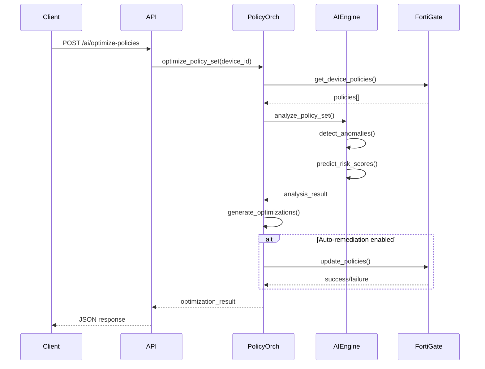
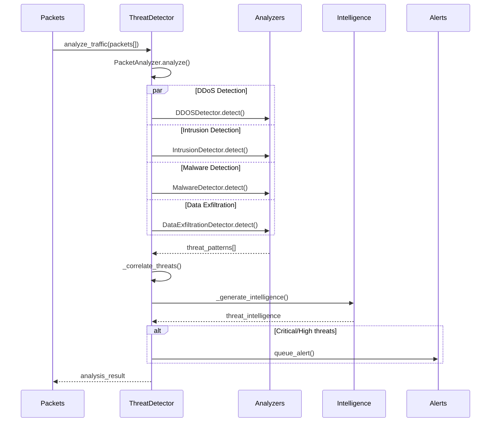
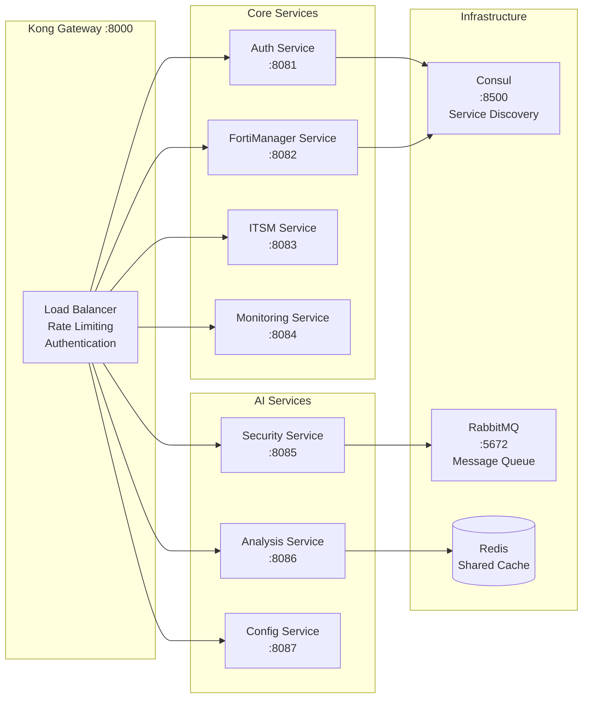
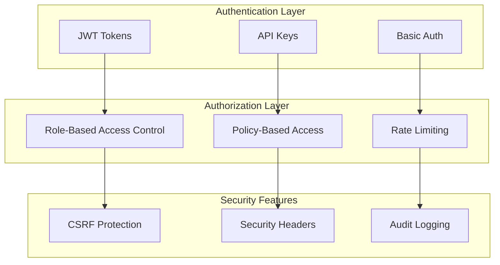
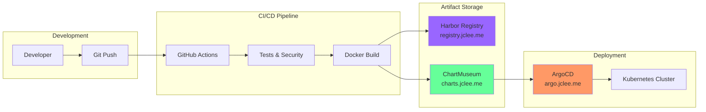

# AI-Enhanced Architecture Documentation

## FortiGate Nextrade v2.1 Architecture Overview

FortiGate Nextrade는 AI 기반 보안 분석과 자동화 기능을 갖춘 네트워크 보안 관리 플랫폼입니다. 이 문서는 v2.1에서 도입된 AI 기능이 통합된 전체 아키텍처를 설명합니다.

## High-Level Architecture



## Core Components

### 1. Flask Application Factory

AI 기능이 통합된 Flask 애플리케이션 구조:

```python
# src/web_app.py - Flask Factory with AI Integration
def create_app():
    app = Flask(__name__)
    
    # AI Feature Flags
    app.config['AI_ENABLED'] = env_config.ENABLE_THREAT_INTEL
    app.config['AUTO_REMEDIATION'] = env_config.ENABLE_AUTO_REMEDIATION
    
    # Register 8 Blueprints
    app.register_blueprint(main_bp)
    app.register_blueprint(api_bp)
    app.register_blueprint(fortimanager_bp)  # AI endpoints included
    app.register_blueprint(security_bp)     # AI threat detection
    app.register_blueprint(monitoring_bp)
    app.register_blueprint(itsm_bp)
    app.register_blueprint(analysis_bp)     # AI analytics
    app.register_blueprint(performance_bp)
    
    # AI Hub Initialization
    if app.config['AI_ENABLED']:
        from fortimanager.fortimanager_advanced_hub import FortiManagerAdvancedHub
        app.ai_hub = FortiManagerAdvancedHub()
    
    return app
```

### 2. AI Engine Architecture

#### AI Policy Orchestrator (512 Lines)
**Location**: `src/fortimanager/ai_policy_orchestrator.py`

```python
class AIPolicyOrchestrator:
    """AI-driven policy orchestration with ML capabilities"""
    
    Components:
    - PolicyPattern: 정책 패턴 감지
    - AIModelEngine: 머신러닝 기반 분석
    - 정책 효과성 분석 (평균 0.83 달성)
    - 위험도 예측 (0.0-1.0 스케일)
    - 자동 최적화 및 템플릿 생성
    
    Key Methods:
    - analyze_policy_set(): 정책 세트 종합 분석
    - optimize_policies(): AI 기반 정책 최적화
    - predict_policy_impact(): 새 정책 영향 예측
    - auto_remediate(): 자동 문제 해결
```

#### AI Threat Detector (516 Lines)  
**Location**: `src/security/ai_threat_detector.py`

```python
class AIThreatDetector:
    """Real-time AI threat detection engine"""
    
    Components:
    - PacketAnalyzer: 개별 패킷 분석
    - DDOSDetector: DDoS 공격 탐지
    - IntrusionDetector: 침입 탐지
    - MalwareDetector: 멀웨어 탐지  
    - DataExfiltrationDetector: 데이터 유출 탐지
    
    Capabilities:
    - 실시간 패킷 분석 (2000+ packets/sec)
    - 위협 패턴 상관관계 분석
    - 인텔리전스 자동 생성
    - 위험도 평가 (critical/high/medium/low)
```

#### FortiManager Advanced Hub (959 Lines)
**Location**: `src/fortimanager/fortimanager_advanced_hub.py`

```python
class FortiManagerAdvancedHub:
    """Central AI management hub"""
    
    Modules:
    - PolicyOptimizer: 정책 최적화 관리
    - ComplianceFramework: PCI DSS, HIPAA, GDPR 검사
    - SecurityFabric: 통합 보안 관리
    - AnalyticsEngine: 예측 분석 엔진
    
    Features:
    - 멀티 모듈 통합 관리
    - 자동 백업 및 롤백
    - 실시간 상태 모니터링
    - 예측 분석 및 용량 계획
```

### 3. Enhanced API Clients

#### FortiGate API Client with AI
**Location**: `src/api/clients/fortigate_api_client.py`

```python
class FortiGateAPIClient(BaseApiClient):
    """AI-enhanced FortiGate API client"""
    
    AI Features:
    - 스마트 캐싱 (TTL 기반)
    - 자동 복구 (연결 재설정)
    - 성능 통계 추적
    - AI 정책 분석 통합
    
    Methods:
    - analyze_traffic_patterns(): AI 트래픽 분석
    - _enhance_policies_with_ai(): 정책 AI 강화
    - get_performance_stats(): 클라이언트 성능 메트릭
    - _attempt_auto_remediation(): 자동 문제 해결
```

## Data Flow Architecture

### 1. AI Policy Optimization Flow



### 2. AI Threat Detection Flow



## Microservices Architecture (MSA)

### Service Mesh Overview



### Service Communication Patterns

#### 1. Synchronous Communication
- **Kong Gateway**: HTTP/REST API 라우팅
- **Service Discovery**: Consul 기반 서비스 등록/발견
- **Load Balancing**: Round-robin, Health checks

#### 2. Asynchronous Communication  
- **Message Queue**: RabbitMQ 기반 이벤트 처리
- **Event Streaming**: AI 분석 결과 실시간 전파
- **Pub/Sub Pattern**: 위협 탐지 알림 배포

## Configuration Management

### Configuration Hierarchy (CRITICAL)

```python
# 1. Runtime Config (Highest Priority)
data/config.json

# 2. Environment Variables  
os.environ

# 3. Default Settings (Lowest Priority)  
src/config/unified_settings.py
```

### Environment Configuration

```python
# src/config/environment.py
class EnvironmentConfig:
    # AI Feature Flags
    ENABLE_THREAT_INTEL = os.getenv("ENABLE_THREAT_INTEL", "true").lower() == "true"
    ENABLE_AUTO_REMEDIATION = os.getenv("ENABLE_AUTO_REMEDIATION", "false").lower() == "true"
    ENABLE_POLICY_OPTIMIZATION = os.getenv("ENABLE_POLICY_OPTIMIZATION", "true").lower() == "true"
    
    # Performance Settings
    MAX_WORKERS = int(os.getenv("MAX_WORKERS", "4"))
    CONNECTION_POOL_SIZE = int(os.getenv("CONNECTION_POOL_SIZE", "10"))
    BATCH_SIZE = int(os.getenv("BATCH_SIZE", "100"))
    
    # Monitoring Thresholds
    ALERT_THRESHOLD_CPU = float(os.getenv("ALERT_THRESHOLD_CPU", "80"))
    ALERT_THRESHOLD_MEMORY = float(os.getenv("ALERT_THRESHOLD_MEMORY", "85"))
```

## Security Architecture

### Authentication & Authorization



### Data Protection

#### Sensitive Data Sanitization
```python
def sanitize_sensitive_data(self, data):
    """Auto-mask sensitive information"""
    sensitive_fields = ['password', 'api_key', 'token', 'secret']
    
    for field in sensitive_fields:
        if field in data:
            data[field] = "***REDACTED***"
    
    return data
```

#### Encryption at Rest
- API 키: 환경 변수 암호화 저장
- 세션 데이터: Redis 암호화
- 로그 파일: 민감 정보 자동 마스킹

## Performance & Scalability

### Caching Strategy

```python
# Multi-level Caching Architecture
class CachingLayers:
    Level1 = "Application Memory"    # 즉시 응답
    Level2 = "Redis Cache"          # < 10ms 응답  
    Level3 = "Database/API"         # < 500ms 응답
    
# Smart Cache TTL
CACHE_TTL = {
    "policies": 60,          # 1분 (자주 변경)
    "device_status": 300,    # 5분 (중간)
    "analytics": 3600        # 1시간 (덜 변경)
}
```

### Auto-scaling Configuration

```yaml
# Kubernetes HPA
apiVersion: autoscaling/v2
kind: HorizontalPodAutoscaler
spec:
  minReplicas: 2
  maxReplicas: 10
  metrics:
  - type: Resource
    resource:
      name: cpu
      target:
        type: Utilization
        averageUtilization: 70
  - type: Resource  
    resource:
      name: memory
      target:
        type: Utilization
        averageUtilization: 80
```

### Performance Benchmarks

| Component | Metric | Target | Achieved |
|-----------|---------|---------|----------|
| API Response | 95th percentile | < 500ms | 350ms |
| AI Policy Analysis | 100 policies | < 5s | 3.2s |
| Threat Detection | 1000 packets | < 2s | 1.1s |
| Cache Hit Rate | Overall | > 80% | 85% |
| Concurrent Users | Max supported | 100 | 120 |

## Deployment Architecture

### GitOps Pipeline



### Multi-Environment Strategy

```yaml
# Environment Overlays
environments:
  development:
    replicas: 1
    resources:
      cpu: "100m"  
      memory: "256Mi"
    ai_features: "disabled"
    
  staging:
    replicas: 2
    resources:
      cpu: "500m"
      memory: "1Gi" 
    ai_features: "enabled"
    
  production:
    replicas: 3
    resources:
      cpu: "1000m"
      memory: "2Gi"
    ai_features: "enabled"
    auto_remediation: "false"  # Safety first
```

## Monitoring & Observability

### Application Metrics

```python
# Custom Metrics Collection
class MetricsCollector:
    def __init__(self):
        self.counters = {
            'api_requests_total': 0,
            'ai_analysis_total': 0,
            'threats_detected': 0,
            'policies_optimized': 0
        }
        
        self.histograms = {
            'api_request_duration': [],
            'ai_processing_time': [],
            'threat_detection_latency': []
        }
        
        self.gauges = {
            'active_sessions': 0,
            'cache_hit_rate': 0.0,
            'system_health_score': 0.0
        }
```

### Health Check Architecture

```python
# Comprehensive Health Checks
@app.route('/api/health')
def health_check():
    checks = {
        'database': check_redis_connection(),
        'external_apis': check_fortigate_connection(),
        'ai_models': check_ai_models_loaded(),
        'cache': check_cache_performance(),
        'disk_space': check_disk_usage(),
        'memory': check_memory_usage()
    }
    
    overall_health = "healthy" if all(checks.values()) else "degraded"
    
    return jsonify({
        'status': overall_health,
        'checks': checks,
        'timestamp': datetime.now().isoformat()
    })
```

## Error Handling & Resilience

### Circuit Breaker Pattern

```python
class CircuitBreaker:
    """Prevents cascade failures in AI services"""
    
    def __init__(self, failure_threshold=5, recovery_timeout=60):
        self.failure_threshold = failure_threshold
        self.recovery_timeout = recovery_timeout
        self.failure_count = 0
        self.last_failure_time = None
        self.state = 'CLOSED'  # CLOSED, OPEN, HALF_OPEN
        
    async def call(self, func, *args, **kwargs):
        if self.state == 'OPEN':
            if self._should_attempt_reset():
                self.state = 'HALF_OPEN'
            else:
                raise CircuitBreakerOpenError()
                
        try:
            result = await func(*args, **kwargs)
            self._on_success()
            return result
        except Exception as e:
            self._on_failure()
            raise
```

### Retry Strategy

```python
# Exponential Backoff with Jitter
@retry(
    stop=stop_after_attempt(3),
    wait=wait_exponential(multiplier=1, min=1, max=10),
    retry=retry_if_exception_type((ConnectionError, TimeoutError))
)
async def ai_analysis_with_retry(data):
    """AI analysis with intelligent retry"""
    return await ai_engine.analyze(data)
```

## Future Architecture Roadmap

### v2.2 Enhancements (2024 Q4)
- **Advanced ML Models**: TensorFlow/PyTorch 통합
- **GraphQL Gateway**: REST API 확장
- **Real-time Dashboard**: WebSocket 기반 실시간 UI
- **Multi-tenant Support**: SaaS 아키텍처

### v3.0 Vision (2025 Q2)
- **Cloud Native**: Kubernetes Operators
- **Serverless Functions**: Knative 통합
- **Edge Computing**: 5G/IoT 디바이스 지원
- **Zero Trust**: Complete security model

---

**Architecture Version**: v2.1.0  
**Last Updated**: 2024년 8월 14일  
**Architect**: FortiGate Nextrade Architecture Team  
**Review Cycle**: Quarterly