# GitOps Deployment Guide

## FortiGate Nextrade v2.1 GitOps 배포 완벽 가이드

이 문서는 FortiGate Nextrade AI-Enhanced 버전의 GitOps 기반 자동 배포 프로세스를 설명합니다.

## Overview

GitOps는 Git을 단일 진실 소스(Single Source of Truth)로 사용하여 애플리케이션과 인프라를 자동으로 배포하는 방법론입니다. 우리 시스템은 다음 4가지 GitOps 원칙을 따릅니다:

1. **선언적(Declarative)**: 모든 시스템 구성을 선언적으로 기술
2. **Git 소스(Versioned)**: Git을 구성의 단일 진실 소스로 사용
3. **풀 기반(Pulled)**: ArgoCD가 Git에서 변경사항을 자동으로 풀
4. **지속적 배포(Continuously Deployed)**: 자동화된 배포 및 롤백

## Architecture Pipeline

```mermaid
graph LR
    subgraph "Developer Workflow"
        DEV[Developer]
        CODE[Code Changes]
        COMMIT[Git Commit]
        PUSH[Git Push]
    end
    
    subgraph "CI Pipeline (GitHub Actions)"
        TRIGGER[Workflow Trigger]
        TEST[🧪 Tests]
        SECURITY[🔒 Security Scan]
        BUILD[🐳 Docker Build]
        PUSH_IMG[📤 Push Image]
    end
    
    subgraph "Artifact Registries"
        HARBOR[🏢 Harbor Registry<br/>registry.jclee.me]
        CHARTS[📦 ChartMuseum<br/>charts.jclee.me]
    end
    
    subgraph "GitOps Engine"
        ARGO[🚀 ArgoCD<br/>argo.jclee.me]
        SYNC[Auto Sync]
        DEPLOY[K8s Deploy]
    end
    
    subgraph "Target Cluster"
        K8S[☸️ Kubernetes]
        PODS[Fortinet Pods]
        SVC[Services]
    end
    
    DEV --> CODE --> COMMIT --> PUSH
    PUSH --> TRIGGER
    TRIGGER --> TEST --> SECURITY --> BUILD --> PUSH_IMG
    
    PUSH_IMG --> HARBOR
    BUILD --> CHARTS
    
    CHARTS --> ARGO
    ARGO --> SYNC --> DEPLOY
    DEPLOY --> K8S --> PODS --> SVC
    
    style ARGO fill:#ff6b6b
    style HARBOR fill:#4ecdc4
    style CHARTS fill:#45b7d1
    style K8S fill:#96ceb4
```



## Prerequisites

### 1. Infrastructure Requirements

- **Kubernetes Cluster**: v1.24+ (현재 v1.28)
- **ArgoCD**: v2.8+ (현재 v2.9)
- **Harbor Registry**: v2.8+
- **ChartMuseum**: v0.16+
- **Git Repository**: GitHub with Actions

### 2. Required Secrets

#### GitHub Repository Secrets
```bash
# Container Registry
REGISTRY_URL=registry.jclee.me
REGISTRY_USERNAME=admin
REGISTRY_PASSWORD=bingogo1

# Helm Chart Repository  
CHARTMUSEUM_URL=https://charts.jclee.me
CHARTMUSEUM_USERNAME=admin
CHARTMUSEUM_PASSWORD=bingogo1

# Deployment
APP_NAME=fortinet
DEPLOYMENT_HOST=192.168.50.110
DEPLOYMENT_PORT=30777

# Optional: Slack notifications
SLACK_WEBHOOK_URL=<webhook-url>
```

#### Kubernetes Secrets
```bash
# Docker registry pull secret
kubectl create secret docker-registry harbor-registry \
  --docker-server=registry.jclee.me \
  --docker-username=admin \
  --docker-password=bingogo1 \
  -n fortinet

# Application secrets (if needed)
kubectl create secret generic fortinet-secrets \
  --from-literal=secret-key="your-secret-key" \
  --from-literal=api-key="your-api-key" \
  -n fortinet
```

## CI/CD Pipeline Configuration

### GitHub Actions Workflow

**File**: `.github/workflows/main-deploy.yml`

```yaml
name: GitOps Deployment Pipeline

on:
  push:
    branches: [ main, master ]
  pull_request:
    branches: [ main, master ]

env:
  REGISTRY_URL: ${{ secrets.REGISTRY_URL }}
  APP_NAME: ${{ secrets.APP_NAME }}
  IMAGE_TAG: ${{ github.sha }}

jobs:
  test:
    name: 🧪 Test & Security
    runs-on: ubuntu-latest
    steps:
    - uses: actions/checkout@v4
    
    - name: Set up Python
      uses: actions/setup-python@v4
      with:
        python-version: '3.11'
    
    - name: Install dependencies
      run: |
        pip install -r requirements.txt
        pip install pytest bandit safety
    
    - name: Run tests in parallel
      run: |
        # Unit tests
        pytest tests/ -v --tb=short &
        PYTEST_PID=$!
        
        # Security scan
        bandit -r src/ -f json -o bandit-report.json &
        BANDIT_PID=$!
        
        # Vulnerability check
        safety check --json --output safety-report.json &
        SAFETY_PID=$!
        
        # Wait for all jobs
        wait $PYTEST_PID $BANDIT_PID $SAFETY_PID
    
    - name: AI Features Test
      run: python tests/test_ai_features.py
    
    - name: Upload test reports
      uses: actions/upload-artifact@v3
      if: always()
      with:
        name: test-reports
        path: |
          bandit-report.json
          safety-report.json

  build:
    name: 🐳 Build & Push
    needs: test
    runs-on: ubuntu-latest
    outputs:
      image: ${{ steps.image.outputs.image }}
      digest: ${{ steps.build.outputs.digest }}
    
    steps:
    - uses: actions/checkout@v4
    
    - name: Set up Docker Buildx
      uses: docker/setup-buildx-action@v3
    
    - name: Login to Harbor
      uses: docker/login-action@v3
      with:
        registry: ${{ secrets.REGISTRY_URL }}
        username: ${{ secrets.REGISTRY_USERNAME }}
        password: ${{ secrets.REGISTRY_PASSWORD }}
    
    - name: Build and push image
      id: build
      uses: docker/build-push-action@v5
      with:
        context: .
        file: ./Dockerfile.production
        push: true
        tags: |
          ${{ secrets.REGISTRY_URL }}/${{ env.APP_NAME }}:${{ env.IMAGE_TAG }}
          ${{ secrets.REGISTRY_URL }}/${{ env.APP_NAME }}:latest
        cache-from: type=gha
        cache-to: type=gha,mode=max
        platforms: linux/amd64,linux/arm64
    
    - id: image
      run: echo "image=${{ secrets.REGISTRY_URL }}/${{ env.APP_NAME }}:${{ env.IMAGE_TAG }}" >> $GITHUB_OUTPUT

  deploy:
    name: 🚀 Deploy to Kubernetes
    needs: [test, build]
    runs-on: ubuntu-latest
    if: github.ref == 'refs/heads/main'
    
    steps:
    - uses: actions/checkout@v4
    
    - name: Install Helm
      uses: azure/setup-helm@v3
      with:
        version: '3.13.0'
    
    - name: Update Helm chart
      run: |
        # Update image tag in values.yaml
        sed -i "s|tag: .*|tag: ${{ env.IMAGE_TAG }}|" charts/fortinet/values.yaml
        
        # Update Chart version
        CHART_VERSION=$(date +%Y%m%d)-${GITHUB_SHA:0:7}
        sed -i "s|version: .*|version: $CHART_VERSION|" charts/fortinet/Chart.yaml
    
    - name: Package and upload Helm chart
      run: |
        helm package charts/fortinet/
        
        # Upload to ChartMuseum
        curl -L --data-binary "@fortinet-*.tgz" \
          -u ${{ secrets.CHARTMUSEUM_USERNAME }}:${{ secrets.CHARTMUSEUM_PASSWORD }} \
          ${{ secrets.CHARTMUSEUM_URL }}/api/charts
    
    - name: Update Kustomization
      run: |
        cd k8s/overlays/production
        
        # Update image
        kustomize edit set image \
          ${{ secrets.REGISTRY_URL }}/${{ env.APP_NAME }}=${{ needs.build.outputs.image }}
        
        # Commit changes (for ArgoCD to detect)
        git config --local user.email "action@github.com"
        git config --local user.name "GitHub Action"
        git add .
        git commit -m "🚀 Deploy ${{ env.IMAGE_TAG }}" || exit 0
        git push
    
    - name: Install ArgoCD CLI
      run: |
        curl -sSL -o argocd-linux-amd64 https://github.com/argoproj/argo-cd/releases/latest/download/argocd-linux-amd64
        sudo install -m 555 argocd-linux-amd64 /usr/local/bin/argocd
        rm argocd-linux-amd64
    
    - name: Trigger ArgoCD Sync
      run: |
        # Login to ArgoCD (using server cert validation skip for self-signed)
        argocd login argo.jclee.me --username admin --password bingogo1 --insecure
        
        # Sync application
        argocd app sync ${{ env.APP_NAME }} --prune --timeout 600
        
        # Wait for sync completion
        argocd app wait ${{ env.APP_NAME }} --timeout 600
    
    - name: Verify Deployment
      run: |
        # Wait for pods to be ready
        sleep 30
        
        # Health check
        curl -f http://${{ secrets.DEPLOYMENT_HOST }}:${{ secrets.DEPLOYMENT_PORT }}/api/health || exit 1
        
        echo "✅ Deployment successful!"
        
        # Get deployment status
        echo "Deployment Status:"
        argocd app get ${{ env.APP_NAME }} --grpc-web -o json | jq -r '.status.health.status'
        echo "Sync Status:"
        argocd app get ${{ env.APP_NAME }} --grpc-web -o json | jq -r '.status.sync.status'

  notify:
    name: 📢 Notify
    needs: [deploy]
    runs-on: ubuntu-latest
    if: always()
    
    steps:
    - name: Notify Slack
      if: env.SLACK_WEBHOOK_URL != ''
      run: |
        STATUS=${{ needs.deploy.result == 'success' && '✅ Success' || '❌ Failed' }}
        COLOR=${{ needs.deploy.result == 'success' && 'good' || 'danger' }}
        
        curl -X POST ${{ secrets.SLACK_WEBHOOK_URL }} \
          -H 'Content-type: application/json' \
          --data '{
            "attachments": [{
              "color": "'$COLOR'",
              "title": "FortiGate Nextrade Deployment",
              "text": "'$STATUS' - Build '${{ github.sha }}' deployed to production",
              "fields": [
                {"title": "Branch", "value": "'${{ github.ref_name }}'", "short": true},
                {"title": "Commit", "value": "'${{ github.sha }}'", "short": true}
              ]
            }]
          }'
```

## Kustomization Configuration

### Base Configuration

**File**: `k8s/base/kustomization.yaml`

```yaml
apiVersion: kustomize.config.k8s.io/v1beta1
kind: Kustomization

metadata:
  name: fortinet-base

resources:
- deployment.yaml
- service.yaml
- configmap.yaml
- serviceaccount.yaml

images:
- name: registry.jclee.me/fortinet
  newTag: latest

commonLabels:
  app: fortinet
  version: v2.1.0
  component: ai-enhanced

commonAnnotations:
  app.kubernetes.io/version: "2.1.0"
  app.kubernetes.io/part-of: "fortinet-platform"
```

### Production Overlay

**File**: `k8s/overlays/production/kustomization.yaml`

```yaml
apiVersion: kustomize.config.k8s.io/v1beta1
kind: Kustomization

metadata:
  name: fortinet-production

namespace: fortinet

bases:
- ../../base

patchesStrategicMerge:
- deployment-patch.yaml
- service-patch.yaml

images:
- name: registry.jclee.me/fortinet
  newTag: 955c1e8e971a9eb683c43246c50085d7ab73abe1

replicas:
- name: fortinet-deployment
  count: 3

resources:
- namespace.yaml
- ingress.yaml
- hpa.yaml

configMapGenerator:
- name: fortinet-config
  envs:
  - config.env

secretGenerator:
- name: fortinet-secrets
  envs:
  - secrets.env

generatorOptions:
  disableNameSuffixHash: true

commonLabels:
  environment: production
  tier: backend

patches:
- target:
    kind: Deployment
    name: fortinet-deployment
  patch: |-
    - op: replace
      path: /spec/template/spec/containers/0/resources
      value:
        requests:
          cpu: 500m
          memory: 1Gi
        limits:
          cpu: 2000m
          memory: 4Gi
    
    - op: add
      path: /spec/template/spec/containers/0/env/-
      value:
        name: APP_MODE
        value: production
    
    - op: add
      path: /spec/template/spec/containers/0/env/-
      value:
        name: ENABLE_THREAT_INTEL
        value: "true"
```

## ArgoCD Application Configuration

### Application Manifest

**File**: `argocd-apps/fortinet-app.yaml`

```yaml
apiVersion: argoproj.io/v1alpha1
kind: Application
metadata:
  name: fortinet
  namespace: argocd
  labels:
    app.kubernetes.io/name: fortinet
    app.kubernetes.io/part-of: fortinet-platform
spec:
  project: default
  
  source:
    repoURL: https://github.com/your-org/fortinet
    targetRevision: main
    path: k8s/overlays/production
  
  destination:
    server: https://kubernetes.default.svc
    namespace: fortinet
  
  syncPolicy:
    automated:
      prune: true
      selfHeal: true
      allowEmpty: false
    syncOptions:
    - CreateNamespace=true
    - PrunePropagationPolicy=foreground
    - PruneLast=true
    
    retry:
      limit: 5
      backoff:
        duration: 5s
        factor: 2
        maxDuration: 3m
  
  revisionHistoryLimit: 10
  
  ignoreDifferences:
  - group: apps
    kind: Deployment
    jsonPointers:
    - /metadata/annotations/deployment.kubernetes.io~1revision
  - group: ""
    kind: Service
    jsonPointers:
    - /metadata/annotations/service.beta.kubernetes.io~1aws-load-balancer-backend-protocol
```

### Project Configuration

**File**: `argocd-apps/fortinet-project.yaml`

```yaml
apiVersion: argoproj.io/v1alpha1
kind: AppProject
metadata:
  name: fortinet-project
  namespace: argocd
spec:
  description: FortiGate Nextrade AI Platform Project
  
  sourceRepos:
  - 'https://github.com/your-org/fortinet'
  - 'https://charts.jclee.me'
  
  destinations:
  - namespace: fortinet
    server: https://kubernetes.default.svc
  - namespace: fortinet-*
    server: https://kubernetes.default.svc
  
  clusterResourceWhitelist:
  - group: ''
    kind: Namespace
  - group: 'rbac.authorization.k8s.io'
    kind: ClusterRole
  - group: 'rbac.authorization.k8s.io'
    kind: ClusterRoleBinding
  
  namespaceResourceWhitelist:
  - group: ''
    kind: ConfigMap
  - group: ''
    kind: Secret
  - group: ''
    kind: Service
  - group: ''
    kind: ServiceAccount
  - group: 'apps'
    kind: Deployment
  - group: 'apps'
    kind: ReplicaSet
  - group: 'autoscaling'
    kind: HorizontalPodAutoscaler
  - group: 'networking.k8s.io'
    kind: Ingress
  - group: 'traefik.containo.us'
    kind: IngressRoute
  
  roles:
  - name: developers
    description: Developers role for Fortinet project
    policies:
    - p, proj:fortinet-project:developers, applications, get, fortinet-project/*, allow
    - p, proj:fortinet-project:developers, applications, sync, fortinet-project/*, allow
    - p, proj:fortinet-project:developers, repositories, get, *, allow
    
    groups:
    - fortinet-developers
    
  - name: operators  
    description: Operators role with full access
    policies:
    - p, proj:fortinet-project:operators, applications, *, fortinet-project/*, allow
    - p, proj:fortinet-project:operators, repositories, *, *, allow
    - p, proj:fortinet-project:operators, clusters, *, *, allow
    
    groups:
    - fortinet-operators
```

## Deployment Strategies

### 1. Blue-Green Deployment

```yaml
# Blue-Green deployment using ArgoCD
apiVersion: argoproj.io/v1alpha1
kind: Rollout
metadata:
  name: fortinet-rollout
spec:
  replicas: 3
  strategy:
    blueGreen:
      activeService: fortinet-active
      previewService: fortinet-preview
      prePromotionAnalysis:
        templates:
        - templateName: success-rate
        args:
        - name: service-name
          value: fortinet-preview
      autoPromotionEnabled: false
      scaleDownDelaySeconds: 30
  selector:
    matchLabels:
      app: fortinet
  template:
    metadata:
      labels:
        app: fortinet
    spec:
      containers:
      - name: fortinet
        image: registry.jclee.me/fortinet:latest
        ports:
        - containerPort: 7777
```

### 2. Canary Deployment

```yaml
# Canary deployment for AI features testing
spec:
  strategy:
    canary:
      steps:
      - setWeight: 10
      - pause: {duration: 1m}
      - analysis:
          templates:
          - templateName: ai-performance
          args:
          - name: service-name
            value: fortinet-canary
      - setWeight: 25
      - pause: {duration: 2m}
      - setWeight: 50
      - pause: {duration: 5m}
      - setWeight: 100
      
      canaryService: fortinet-canary
      stableService: fortinet-stable
      
      trafficRouting:
        traefik:
          weightedPools:
          - serviceName: fortinet-stable
            servicePort: 80
            weight: 100
          - serviceName: fortinet-canary  
            servicePort: 80
            weight: 0
```

## Monitoring & Observability

### Deployment Health Monitoring

```bash
#!/bin/bash
# deployment-monitor.sh

APP_NAME="fortinet"
NAMESPACE="fortinet"
HEALTH_URL="http://192.168.50.110:30777/api/health"

echo "🔍 Monitoring deployment health..."

# Check ArgoCD sync status
SYNC_STATUS=$(argocd app get $APP_NAME --grpc-web -o json | jq -r '.status.sync.status // "Unknown"')
HEALTH_STATUS=$(argocd app get $APP_NAME --grpc-web -o json | jq -r '.status.health.status // "Unknown"')

echo "ArgoCD Sync Status: $SYNC_STATUS"
echo "ArgoCD Health Status: $HEALTH_STATUS"

# Check Kubernetes pods
echo -e "\n📦 Pod Status:"
kubectl get pods -n $NAMESPACE -l app=$APP_NAME

# Check service endpoints
echo -e "\n🌐 Service Status:" 
kubectl get svc -n $NAMESPACE -l app=$APP_NAME

# Health check
echo -e "\n❤️ Application Health:"
if curl -f -s $HEALTH_URL > /dev/null; then
    echo "✅ Application is healthy"
    curl -s $HEALTH_URL | jq '.services'
else
    echo "❌ Application health check failed"
    exit 1
fi

# AI Features check
echo -e "\n🤖 AI Features Status:"
AI_STATUS=$(curl -s "$HEALTH_URL" | jq -r '.ai_status.enabled // false')
if [ "$AI_STATUS" = "true" ]; then
    echo "✅ AI features are enabled and running"
else
    echo "⚠️ AI features are disabled"
fi

echo -e "\n✅ Monitoring complete"
```

### Performance Monitoring

```yaml
# ServiceMonitor for Prometheus
apiVersion: monitoring.coreos.com/v1
kind: ServiceMonitor
metadata:
  name: fortinet-metrics
  namespace: fortinet
spec:
  selector:
    matchLabels:
      app: fortinet
  endpoints:
  - port: http
    path: /api/monitoring/metrics
    interval: 30s
    scrapeTimeout: 10s
  namespaceSelector:
    matchNames:
    - fortinet
```

## Troubleshooting

### Common Issues

#### 1. ArgoCD Sync Failures

```bash
# Check sync status
argocd app get fortinet --refresh

# View sync details
argocd app sync fortinet --dry-run

# Force sync with prune
argocd app sync fortinet --prune --force

# Check application events
kubectl describe application fortinet -n argocd
```

#### 2. Image Pull Errors

```bash
# Check image pull secret
kubectl get secrets -n fortinet | grep harbor-registry

# Test image pull manually
kubectl run test-pod --image=registry.jclee.me/fortinet:latest --rm -it -- /bin/bash

# Create/update pull secret
kubectl delete secret harbor-registry -n fortinet
kubectl create secret docker-registry harbor-registry \
  --docker-server=registry.jclee.me \
  --docker-username=admin \
  --docker-password=bingogo1 \
  -n fortinet
```

#### 3. Kustomization Errors

```bash
# Validate kustomization
kustomize build k8s/overlays/production/

# Check for syntax errors
kubectl apply --dry-run=client -k k8s/overlays/production/

# Fix kustomization format
kustomize edit fix k8s/overlays/production/
```

#### 4. Health Check Failures

```bash
# Check pod logs
kubectl logs -l app=fortinet -n fortinet --tail=100

# Check service endpoints
kubectl get endpoints -n fortinet

# Test internal service
kubectl run debug --image=busybox --rm -it -- /bin/sh
# Inside pod: wget -O- http://fortinet-service.fortinet.svc.cluster.local:7777/api/health
```

### Rollback Procedures

#### 1. ArgoCD Rollback

```bash
# List application history
argocd app history fortinet

# Rollback to previous version
argocd app rollback fortinet <revision-id>

# Example: rollback to revision 5
argocd app rollback fortinet 5
```

#### 2. Kubernetes Rollback

```bash
# Check deployment history
kubectl rollout history deployment/fortinet-deployment -n fortinet

# Rollback deployment
kubectl rollout undo deployment/fortinet-deployment -n fortinet

# Rollback to specific revision
kubectl rollout undo deployment/fortinet-deployment --to-revision=2 -n fortinet
```

#### 3. Database/Config Rollback

```bash
# If using configmap/secret changes
kubectl get configmap fortinet-config -n fortinet -o yaml > config-backup.yaml

# Restore previous config
kubectl apply -f previous-config.yaml

# Restart deployment to pick up changes
kubectl rollout restart deployment/fortinet-deployment -n fortinet
```

## Security Best Practices

### 1. RBAC Configuration

```yaml
# Minimal RBAC for deployment
apiVersion: rbac.authorization.k8s.io/v1
kind: Role
metadata:
  namespace: fortinet
  name: fortinet-deployer
rules:
- apiGroups: [""]
  resources: ["pods", "services", "configmaps", "secrets"]
  verbs: ["get", "list", "watch", "create", "update", "patch", "delete"]
- apiGroups: ["apps"]
  resources: ["deployments", "replicasets"]
  verbs: ["get", "list", "watch", "create", "update", "patch", "delete"]
- apiGroups: ["autoscaling"]
  resources: ["horizontalpodautoscalers"]
  verbs: ["get", "list", "watch", "create", "update", "patch", "delete"]
---
apiVersion: rbac.authorization.k8s.io/v1
kind: RoleBinding
metadata:
  name: fortinet-deployer-binding
  namespace: fortinet
subjects:
- kind: ServiceAccount
  name: fortinet-deployer
  namespace: fortinet
roleRef:
  kind: Role
  name: fortinet-deployer
  apiGroup: rbac.authorization.k8s.io
```

### 2. Network Policies

```yaml
# Network policy for fortinet namespace
apiVersion: networking.k8s.io/v1
kind: NetworkPolicy
metadata:
  name: fortinet-network-policy
  namespace: fortinet
spec:
  podSelector:
    matchLabels:
      app: fortinet
  policyTypes:
  - Ingress
  - Egress
  
  ingress:
  - from:
    - namespaceSelector:
        matchLabels:
          name: traefik
    ports:
    - protocol: TCP
      port: 7777
  
  egress:
  - to: []
    ports:
    - protocol: TCP
      port: 53    # DNS
    - protocol: UDP
      port: 53    # DNS
  - to: []
    ports:
    - protocol: TCP
      port: 443   # HTTPS
    - protocol: TCP
      port: 6379  # Redis
```

### 3. Pod Security Standards

```yaml
# Pod Security Policy
apiVersion: policy/v1beta1
kind: PodSecurityPolicy
metadata:
  name: fortinet-psp
spec:
  privileged: false
  allowPrivilegeEscalation: false
  requiredDropCapabilities:
    - ALL
  volumes:
    - 'configMap'
    - 'emptyDir'
    - 'projected'
    - 'secret'
    - 'downwardAPI'
    - 'persistentVolumeClaim'
  runAsUser:
    rule: 'MustRunAsNonRoot'
  seLinux:
    rule: 'RunAsAny'
  fsGroup:
    rule: 'RunAsAny'
```

## Performance Optimization

### 1. Resource Management

```yaml
# Optimized resource allocation
resources:
  requests:
    cpu: 500m      # 0.5 CPU cores
    memory: 1Gi    # 1 GB memory
  limits:
    cpu: 2000m     # 2 CPU cores
    memory: 4Gi    # 4 GB memory

# JVM/Python optimization
env:
- name: PYTHONUNBUFFERED
  value: "1"
- name: MAX_WORKERS
  value: "4"
- name: CONNECTION_POOL_SIZE
  value: "20"
- name: CACHE_TTL
  value: "300"
```

### 2. HPA Configuration

```yaml
# Horizontal Pod Autoscaler
apiVersion: autoscaling/v2
kind: HorizontalPodAutoscaler
metadata:
  name: fortinet-hpa
  namespace: fortinet
spec:
  scaleTargetRef:
    apiVersion: apps/v1
    kind: Deployment
    name: fortinet-deployment
  
  minReplicas: 2
  maxReplicas: 10
  
  metrics:
  - type: Resource
    resource:
      name: cpu
      target:
        type: Utilization
        averageUtilization: 70
        
  - type: Resource
    resource:
      name: memory
      target:
        type: Utilization
        averageUtilization: 80
        
  - type: Pods
    pods:
      metric:
        name: ai_processing_time
      target:
        type: AverageValue
        averageValue: "500m"  # 500ms

  behavior:
    scaleUp:
      stabilizationWindowSeconds: 60
      policies:
      - type: Percent
        value: 50
        periodSeconds: 60
    scaleDown:
      stabilizationWindowSeconds: 300
      policies:
      - type: Percent
        value: 10
        periodSeconds: 60
```

## GitOps Best Practices

### 1. Repository Structure

```
fortinet/
├── .github/workflows/           # CI/CD pipelines
├── k8s/
│   ├── base/                   # Base Kubernetes manifests
│   └── overlays/               # Environment-specific overlays
│       ├── development/
│       ├── staging/
│       └── production/
├── charts/fortinet/            # Helm charts
├── argocd-apps/               # ArgoCD application definitions
├── scripts/                   # Deployment scripts
└── docs/deployment/           # Deployment documentation
```

### 2. Git Workflow

```bash
# Feature branch workflow
git checkout -b feature/ai-enhancement
# Make changes
git add .
git commit -m "feat: Add AI threat detection enhancements"
git push origin feature/ai-enhancement

# Create PR → Review → Merge to main
# GitOps pipeline automatically triggers

# Hotfix workflow
git checkout -b hotfix/security-fix
# Apply critical fix
git add .
git commit -m "hotfix: Fix security vulnerability CVE-2024-xxxx"
git push origin hotfix/security-fix
# Emergency merge → Immediate deployment
```

### 3. Environment Promotion

```bash
# Development → Staging
git checkout staging
git merge main
git push origin staging

# Staging → Production (with approval)
git checkout production  
git merge staging
git tag v2.1.1
git push origin production --tags
```

---

**Document Version**: v2.1.0  
**Last Updated**: 2024년 8월 14일  
**Maintained by**: DevOps Team  
**Review Schedule**: Monthly

**Quick Links**:
- 🚀 [ArgoCD Dashboard](https://argo.jclee.me)
- 🐳 [Harbor Registry](https://registry.jclee.me) 
- 📦 [ChartMuseum](https://charts.jclee.me)
- 📊 [Application Health](http://192.168.50.110:30777/api/health)