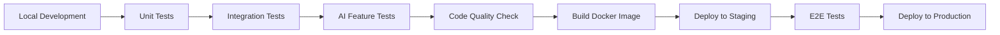

# FortiGate Nextrade Developer Guide

## AI-Enhanced Development Environment v2.1.0

This comprehensive guide provides developers with everything needed to build, test, and deploy AI-enhanced features for the FortiGate Nextrade platform.

---

## Table of Contents

1. [Quick Start Development](#quick-start-development)
2. [AI Components Architecture](#ai-components-architecture)
3. [Development Workflows](#development-workflows)
4. [Testing AI Features](#testing-ai-features)
5. [Code Quality & Standards](#code-quality--standards)
6. [Debugging & Troubleshooting](#debugging--troubleshooting)
7. [Deployment & CI/CD](#deployment--cicd)
8. [Performance Optimization](#performance-optimization)

---

## Quick Start Development

### Environment Setup

```bash
# Clone the repository
git clone https://github.com/your-org/fortinet.git
cd fortinet

# Install dependencies with development extras
pip install -r requirements.txt
pip install -e ".[dev]"

# Set up development environment
export APP_MODE=test
export ENABLE_THREAT_INTEL=true
export ENABLE_POLICY_OPTIMIZATION=true
export ENABLE_AUTO_REMEDIATION=false  # Safety for development

# Run the application
cd src && python main.py --web
```

### Development Server

The application runs on port 7777 by default:

```bash
# Access development server
http://localhost:7777

# API documentation
http://localhost:7777/api/docs

# AI feature dashboard
http://localhost:7777/dashboard/ai-features
```

---

## AI Components Architecture

### Core AI Modules

#### 1. AI Policy Orchestrator (`src/fortimanager/ai_policy_orchestrator.py`)

**Purpose**: Machine learning-based policy optimization and automation

**Key Classes**:
- `AIPolicyOrchestrator`: Main orchestration engine
- `PolicyPattern`: Pattern detection system
- `AIModelEngine`: Core ML algorithms

**Development Usage**:
```python
from fortimanager.ai_policy_orchestrator import AIPolicyOrchestrator

# Initialize orchestrator
orchestrator = AIPolicyOrchestrator(api_client)

# Analyze policies
analysis = orchestrator.analyze_policy_set(policies)

# Generate optimized policies
optimized = orchestrator.optimize_policies(policies)
```

**Key Features**:
- Policy effectiveness scoring (0.0-1.0)
- Risk assessment algorithms
- Pattern detection (duplicates, overly permissive, unused)
- Auto-remediation strategies

#### 2. AI Threat Detector (`src/security/ai_threat_detector.py`)

**Purpose**: Real-time traffic analysis and threat detection

**Key Classes**:
- `AIThreatDetector`: Main threat analysis engine
- `PacketAnalyzer`: Individual packet analysis
- `ThreatLevel`: Threat severity enumeration

**Development Usage**:
```python
from security.ai_threat_detector import AIThreatDetector

# Initialize detector
detector = AIThreatDetector()

# Analyze traffic (async)
analysis = await detector.analyze_traffic(packets)
```

**Features**:
- Real-time packet analysis
- Anomaly detection algorithms
- Threat pattern recognition
- Risk scoring (0.0-1.0)

#### 3. FortiManager Advanced Hub (`src/fortimanager/fortimanager_advanced_hub.py`)

**Purpose**: Central management hub integrating all AI components

**Key Classes**:
- `PolicyOptimizer`: Policy optimization workflows
- `ComplianceFramework`: Compliance checking and remediation
- `SecurityFabric`: Integrated security management
- `AnalyticsEngine`: Advanced analytics and predictions

**Development Usage**:
```python
from fortimanager.fortimanager_advanced_hub import FortiManagerAdvancedHub

# Initialize hub
hub = FortiManagerAdvancedHub()

# Get hub status
status = hub.get_hub_status()

# Execute advanced operations
result = await hub.execute_advanced_operation("optimize_policies", params)
```

---

## Development Workflows

### 1. Feature Development Workflow

```bash
# 1. Create feature branch
git checkout -b feature/ai-enhancement-xyz

# 2. Develop with TDD approach
pytest tests/unit/test_new_feature.py -v --watch

# 3. Run comprehensive tests
pytest tests/ -m "not slow" -v
pytest tests/test_ai_features.py -v

# 4. Code quality checks
black src/ && isort src/ && flake8 src/ --max-line-length=120

# 5. Integration testing
python tests/test_ai_features.py
```

### 2. AI Model Development

#### Adding New AI Algorithms

1. **Extend AIModelEngine**:
```python
class AIModelEngine:
    def analyze_new_pattern(self, data: List[Dict]) -> List[Pattern]:
        # Implement your algorithm
        patterns = []
        # ... algorithm logic
        return patterns
```

2. **Create Unit Tests**:
```python
def test_new_pattern_detection():
    engine = AIModelEngine()
    test_data = [...]  # Test data
    patterns = engine.analyze_new_pattern(test_data)
    assert len(patterns) > 0
    assert patterns[0].confidence > 0.7
```

3. **Integration with Orchestrator**:
```python
def analyze_policy_set(self, policies):
    # Add your new analysis
    new_patterns = self.ai_engine.analyze_new_pattern(policies)
    # Integrate with existing analysis
```

### 3. API Endpoint Development

#### Creating AI-Enhanced Endpoints

```python
# In routes/fortimanager_routes.py
@fortimanager_bp.route("/ai/new-analysis", methods=["POST"])
async def new_ai_analysis():
    try:
        data = request.get_json()
        hub = FortiManagerAdvancedHub()
        result = await hub.your_new_analysis(data)
        return jsonify({"success": True, "result": result})
    except Exception as e:
        logger.error(f"New AI analysis failed: {e}")
        return jsonify({"success": False, "message": str(e)}), 500
```

---

## Testing AI Features

### Test Structure

```
tests/
├── unit/                    # Unit tests for individual components
│   ├── test_ai_orchestrator.py
│   ├── test_threat_detector.py
│   └── test_advanced_hub.py
├── integration/             # Integration tests
│   └── test_ai_integration.py
├── functional/              # Feature validation tests
│   └── test_ai_features.py
└── manual/                  # Manual testing scenarios
    └── ai_test_scenarios.py
```

### Running AI Feature Tests

```bash
# Run all AI tests
python tests/test_ai_features.py

# Run specific AI component tests
pytest tests/unit/test_ai_orchestrator.py -v
pytest tests/unit/test_threat_detector.py -v

# Run with coverage
pytest tests/ --cov=src --cov-report=html -v

# Performance testing
pytest tests/performance/ -v
```

### Test Data Generation

```python
# Generate test policies for AI testing
def generate_test_policies(count=100):
    policies = []
    for i in range(count):
        policy = {
            "policyid": str(i + 1),
            "srcaddr": random.choice([["all"], ["10.0.0.0/8"], ["192.168.1.0/24"]]),
            "dstaddr": random.choice([["all"], ["dmz_net"], ["server_net"]]),
            "action": random.choice(["accept", "deny"]),
            "service": random.choice([["ALL"], ["HTTPS"], ["SSH", "HTTP"]]),
            "logtraffic": random.choice([None, "all", "utm"])
        }
        policies.append(policy)
    return policies
```

### Mock AI Responses

For development and testing, use mock responses:

```python
# Mock AI analysis for testing
class MockAIOrchestrator:
    def analyze_policy_set(self, policies):
        return {
            "policy_count": len(policies),
            "metrics": {"avg_effectiveness": 0.75, "avg_risk_score": 0.45},
            "patterns": [{"type": "duplicate_policy", "confidence": 0.9}],
            "recommendations": [{"type": "remove_duplicate", "severity": "medium"}]
        }
```

---

## Code Quality & Standards

### ESLint-Equivalent Python Standards

```python
# File structure standards
max_lines_per_file = 500
max_lines_per_function = 100

# Code style (enforced by black + flake8)
line_length = 120
quote_style = "double"  # Use double quotes consistently
```

### AI Code Standards

#### 1. Function Documentation

```python
def analyze_policy_effectiveness(self, policy: Dict[str, Any]) -> float:
    """
    Analyze policy effectiveness using AI heuristics.
    
    Args:
        policy: Policy configuration dictionary
        
    Returns:
        Effectiveness score between 0.0 and 1.0
        
    Raises:
        ValueError: If policy format is invalid
        
    Example:
        >>> analyzer = AIModelEngine()
        >>> score = analyzer.analyze_policy_effectiveness({"action": "accept"})
        >>> assert 0.0 <= score <= 1.0
    """
```

#### 2. Error Handling

```python
async def ai_operation(self, data):
    try:
        result = await self.ai_engine.process(data)
        return result
    except AIProcessingError as e:
        logger.error(f"AI processing failed: {e}")
        return {"error": "AI_PROCESSING_FAILED", "details": str(e)}
    except Exception as e:
        logger.error(f"Unexpected error in AI operation: {e}")
        return {"error": "UNEXPECTED_ERROR", "details": str(e)}
```

#### 3. Performance Monitoring

```python
import time
from functools import wraps

def monitor_ai_performance(func):
    @wraps(func)
    async def wrapper(*args, **kwargs):
        start_time = time.time()
        try:
            result = await func(*args, **kwargs)
            execution_time = time.time() - start_time
            logger.info(f"AI operation {func.__name__} completed in {execution_time:.2f}s")
            return result
        except Exception as e:
            execution_time = time.time() - start_time
            logger.error(f"AI operation {func.__name__} failed after {execution_time:.2f}s: {e}")
            raise
    return wrapper
```

### Pre-commit Hooks

```bash
# Install pre-commit hooks
pip install pre-commit
pre-commit install

# Manual run
pre-commit run --all-files
```

---

## Debugging & Troubleshooting

### AI Component Debugging

#### 1. Enable Detailed Logging

```python
# In your development environment
import logging
logging.getLogger('fortimanager.ai_policy_orchestrator').setLevel(logging.DEBUG)
logging.getLogger('security.ai_threat_detector').setLevel(logging.DEBUG)
```

#### 2. AI Analysis Debugging

```python
# Debug policy analysis
def debug_policy_analysis(policies):
    orchestrator = AIPolicyOrchestrator()
    
    print(f"Analyzing {len(policies)} policies...")
    
    for i, policy in enumerate(policies[:5]):  # Debug first 5
        effectiveness = orchestrator.ai_engine.analyze_policy_effectiveness(policy)
        risk = orchestrator.ai_engine.predict_risk_score(policy)
        print(f"Policy {i}: effectiveness={effectiveness:.2f}, risk={risk:.2f}")
    
    # Full analysis
    analysis = orchestrator.analyze_policy_set(policies)
    print(f"Overall metrics: {analysis['metrics']}")
    print(f"Patterns found: {len(analysis['patterns'])}")
```

#### 3. Threat Detection Debugging

```python
# Debug threat analysis
async def debug_threat_detection(packets):
    detector = AIThreatDetector()
    
    # Analyze individual packets
    for i, packet in enumerate(packets[:3]):
        analysis = detector.packet_analyzer.analyze_packet(packet)
        print(f"Packet {i}: risk={analysis['risk_score']:.2f}")
    
    # Full traffic analysis
    result = await detector.analyze_traffic(packets)
    print(f"Threats detected: {result['threats_detected']}")
    print(f"Risk level: {result['risk_assessment']['level']}")
```

### Common Issues & Solutions

#### 1. AI Model Performance Issues

**Issue**: Slow AI analysis with large policy sets
```python
# Solution: Implement batching
def analyze_policy_set_batched(self, policies, batch_size=50):
    results = []
    for i in range(0, len(policies), batch_size):
        batch = policies[i:i + batch_size]
        batch_result = self._analyze_batch(batch)
        results.append(batch_result)
    return self._combine_results(results)
```

#### 2. Memory Issues with Large Datasets

**Issue**: Out of memory errors during threat analysis
```python
# Solution: Use generators and streaming
def stream_packet_analysis(self, packets):
    for packet_batch in self._batch_packets(packets, 1000):
        yield self._analyze_batch(packet_batch)
```

#### 3. AI Component Import Errors

**Issue**: ImportError when AI components are not available
```python
# Solution: Graceful degradation
try:
    from fortimanager.ai_policy_orchestrator import AIPolicyOrchestrator
    AI_ENABLED = True
except ImportError:
    logger.warning("AI components not available, using fallback")
    AI_ENABLED = False
    
    class FallbackOrchestrator:
        def analyze_policy_set(self, policies):
            return {"error": "AI components not available"}
```

---

## Deployment & CI/CD

### Development to Production Pipeline



### Docker Development

```dockerfile
# Development Dockerfile
FROM python:3.11-slim

WORKDIR /app

# Install development dependencies
COPY requirements.txt requirements-dev.txt ./
RUN pip install -r requirements-dev.txt

# Copy source code
COPY src/ ./src/
COPY tests/ ./tests/

# Development startup
CMD ["python", "src/main.py", "--web", "--debug"]
```

### Environment Configuration

```bash
# Development environment
export APP_MODE=development
export LOG_LEVEL=DEBUG
export ENABLE_AI_FEATURES=true
export ENABLE_PERFORMANCE_MONITORING=true

# Testing environment
export APP_MODE=test
export MOCK_AI_RESPONSES=true
export DISABLE_EXTERNAL_CALLS=true

# Production environment
export APP_MODE=production
export LOG_LEVEL=INFO
export ENABLE_AUTO_REMEDIATION=true
export MONITORING_ENABLED=true
```

---

## Performance Optimization

### AI Component Optimization

#### 1. Caching Strategies

```python
from utils.unified_cache_manager import cached

class AIPolicyOrchestrator:
    @cached(ttl=300)  # Cache for 5 minutes
    def analyze_policy_set(self, policies):
        # Expensive AI analysis
        return analysis_result

    @cached(ttl=60, key_generator=lambda p: hash(str(p)))
    def predict_risk_score(self, policy):
        # Cache individual policy risk scores
        return risk_score
```

#### 2. Asynchronous Processing

```python
import asyncio

async def batch_policy_analysis(self, policy_batches):
    """Process multiple policy batches concurrently"""
    tasks = []
    for batch in policy_batches:
        task = asyncio.create_task(self._analyze_batch(batch))
        tasks.append(task)
    
    results = await asyncio.gather(*tasks)
    return self._merge_results(results)
```

#### 3. Database Optimization

```python
# Optimize for large policy sets
class PolicyDatabase:
    def get_policies_optimized(self, device_id, limit=1000):
        """Get policies with optimization for AI analysis"""
        query = """
        SELECT policyid, srcaddr, dstaddr, action, service, logtraffic
        FROM policies 
        WHERE device_id = %s 
        ORDER BY policyid 
        LIMIT %s
        """
        return self.execute_query(query, (device_id, limit))
```

### Monitoring & Profiling

```python
# Performance monitoring
import cProfile
import pstats

def profile_ai_analysis():
    profiler = cProfile.Profile()
    profiler.enable()
    
    # Run AI analysis
    orchestrator = AIPolicyOrchestrator()
    result = orchestrator.analyze_policy_set(large_policy_set)
    
    profiler.disable()
    stats = pstats.Stats(profiler)
    stats.sort_stats('cumulative')
    stats.print_stats(10)  # Top 10 functions
```

---

## Advanced Topics

### Custom AI Algorithm Development

#### Implementing New Threat Detection Patterns

```python
class CustomThreatPattern:
    """Custom threat detection pattern"""
    
    def detect_pattern(self, packets: List[Dict]) -> List[Threat]:
        threats = []
        
        # Implement your algorithm
        for packet in packets:
            if self._matches_pattern(packet):
                threat = Threat(
                    type="custom_threat",
                    confidence=self._calculate_confidence(packet),
                    details=self._extract_details(packet)
                )
                threats.append(threat)
        
        return threats
    
    def _matches_pattern(self, packet: Dict) -> bool:
        # Your pattern matching logic
        return False
    
    def _calculate_confidence(self, packet: Dict) -> float:
        # Confidence calculation (0.0-1.0)
        return 0.5
```

### Integration with External AI Services

```python
# Example: Integration with external ML service
class ExternalAIIntegration:
    def __init__(self, api_endpoint, api_key):
        self.endpoint = api_endpoint
        self.api_key = api_key
    
    async def analyze_with_external_ai(self, data):
        headers = {"Authorization": f"Bearer {self.api_key}"}
        async with aiohttp.ClientSession() as session:
            async with session.post(
                self.endpoint,
                json=data,
                headers=headers
            ) as response:
                return await response.json()
```

---

## Contributing Guidelines

### Code Contribution Process

1. **Fork and Clone**: Fork the repository and create a feature branch
2. **Develop**: Implement your feature following the coding standards
3. **Test**: Write comprehensive tests for your changes
4. **Document**: Update documentation and add code comments
5. **Submit**: Create a pull request with detailed description

### AI Feature Contribution Checklist

- [ ] Unit tests with >80% coverage
- [ ] Integration tests with real/mock data
- [ ] Performance benchmarks
- [ ] Documentation updates
- [ ] Error handling and logging
- [ ] Security review (no hardcoded credentials)
- [ ] Backward compatibility check

---

## Resources & References

### Documentation Links

- [API Documentation](../api/AI_FEATURES_API.md)
- [Architecture Guide](../architecture/AI_ENHANCED_ARCHITECTURE.md)
- [Deployment Guide](../deployment/GITOPS_DEPLOYMENT_GUIDE.md)

### External Resources

- [FortiManager API Documentation](https://docs.fortinet.com/fortimanager)
- [FortiGate API Reference](https://docs.fortinet.com/fortigate)
- [Python Async Programming](https://docs.python.org/3/library/asyncio.html)
- [Machine Learning Best Practices](https://developers.google.com/machine-learning/guides/rules-of-ml)

### Development Tools

- **IDE**: VS Code with Python extension
- **Debugging**: pdb, pytest-pdb
- **Profiling**: cProfile, line_profiler
- **Testing**: pytest, pytest-asyncio, pytest-cov
- **Code Quality**: black, isort, flake8, mypy

---

## Appendix

### Environment Variables Reference

| Variable | Description | Default | Example |
|----------|-------------|---------|---------|
| `APP_MODE` | Application mode | `production` | `development`, `test`, `production` |
| `ENABLE_THREAT_INTEL` | Enable AI threat intelligence | `false` | `true`, `false` |
| `ENABLE_POLICY_OPTIMIZATION` | Enable AI policy optimization | `false` | `true`, `false` |
| `ENABLE_AUTO_REMEDIATION` | Enable auto-remediation | `false` | `true`, `false` |
| `LOG_LEVEL` | Logging level | `INFO` | `DEBUG`, `INFO`, `WARNING`, `ERROR` |
| `WEB_APP_PORT` | Application port | `7777` | `7777` |

### Troubleshooting Quick Reference

| Issue | Solution |
|-------|----------|
| `ImportError: No module named 'fortimanager'` | Ensure you're running from `src/` directory |
| `AI components not available` | Install development dependencies: `pip install -e ".[dev]"` |
| `Port 7777 already in use` | Kill existing process: `sudo lsof -ti:7777 \| xargs kill -9` |
| `Connection refused to FortiManager` | Check `APP_MODE=test` for mock mode |
| `Out of memory during analysis` | Reduce batch size or enable streaming mode |

---

*This developer guide is continuously updated to reflect the latest AI enhancements and development practices. For questions or suggestions, please contact the development team or create an issue in the repository.*